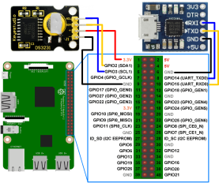

# Tiny Zigbee Gateway

## Hardware setup

This project uses a DS3231 i2C module to keep the clock sync. A serial adapter is also added in case of emergencies

Connections are as follows:


## Software steps

### UART on GPIO

Enable UART on GPIO: Add `enable_uart=1` to `/boot/config.txt`

### RTC Module

Source: https://learn.adafruit.com/adding-a-real-time-clock-to-raspberry-pi/set-rtc-time

run `sudo raspi-config` and under Advanced select I2C and turn it on.
Reboot once you've done that with `sudo reboot`.

Verify wiring by running

```bash
sudo apt-get install python-smbus i2c-tools
```

to install the helper software and then `sudo i2cdetect -y 1` at the command line, you should see ID #68 show up - that's the address of the DS3231.

```
pi@raspberrypi:~ $ sudo i2cdetect -y 1
     0  1  2  3  4  5  6  7  8  9  a  b  c  d  e  f
00:          -- -- -- -- -- -- -- -- -- -- -- -- --
10: -- -- -- -- -- -- -- -- -- -- -- -- -- -- -- --
20: -- -- -- -- -- -- -- -- -- -- -- -- -- -- -- --
30: -- -- -- -- -- -- -- -- -- -- -- -- -- -- -- --
40: -- -- -- -- -- -- -- -- -- -- -- -- -- -- -- --
50: -- -- -- -- -- -- -- -- -- -- -- -- -- -- -- --
60: -- -- -- -- -- -- -- -- 68 -- -- -- -- -- -- --
70: -- -- -- -- -- -- -- --
```

For a release with `systemd` you can add support for the RTC by adding a device tree overlay. Run

```bash
sudo nano /boot/config.txt
```

to edit the pi configuration and add

```bash
dtoverlay=i2c-rtc,ds3231
```

to the end of the file. Save it and run `sudo reboot` to start again. Log in and run `sudo i2cdetect -y 1` to see the `UU` show up where `0x68` should be

```bash
pi@raspberrypi:~ $ sudo i2cdetect -y 1
     0  1  2  3  4  5  6  7  8  9  a  b  c  d  e  f
00:          -- -- -- -- -- -- -- -- -- -- -- -- --
10: -- -- -- -- -- -- -- -- -- -- -- -- -- -- -- --
20: -- -- -- -- -- -- -- -- -- -- -- -- -- -- -- --
30: -- -- -- -- -- -- -- -- -- -- -- -- -- -- -- --
40: -- -- -- -- -- -- -- -- -- -- -- -- -- -- -- --
50: -- -- -- -- -- -- -- -- -- -- -- -- -- -- -- --
60: -- -- -- -- -- -- -- -- UU -- -- -- -- -- -- --
70: -- -- -- -- -- -- -- --
```

Disable the "fake hwclock" which interferes with the 'real' hwclock

- `sudo apt-get -y remove fake-hwclock`
- `sudo update-rc.d -f fake-hwclock remove`
- `sudo systemctl disable fake-hwclock`

Now with the fake-hw clock off, you can start the original 'hardware clock' script.

Run `sudo nano /lib/udev/hwclock-set` and comment out these three lines with `#`:

```bash
if [ -e /run/systemd/system ] ; then
 exit 0
fi
```

Also comment out the two lines

```bash
/sbin/hwclock --rtc=$dev --systz --badyear
```

and

```bash
/sbin/hwclock --rtc=$dev --systz
```

When you first plug in the RTC module, it's going to have the wrong time because it has to be set once. You can always read the time directly from the RTC with `sudo hwclock -r --verbose`

```
pi@raspberrypi:~ $ sudo hwclock -r --verbose
hwclock from util-linux 2.33.1
System Time: 1628696789.518548
Trying to open: /dev/rtc0
Using the rtc interface to the clock.
Last drift adjustment done at 1628430386 seconds after 1969
Last calibration done at 1628430386 seconds after 1969
Hardware clock is on UTC time
Assuming hardware clock is kept in UTC time.
Waiting for clock tick...
...got clock tick
Time read from Hardware Clock: 2021/08/11 15:46:30
Hw clock time : 2021/08/11 15:46:30 = 1628696790 seconds since 1969
Time since last adjustment is 266404 seconds
Calculated Hardware Clock drift is 0.000000 seconds
2021-08-11 17:46:29.987576+02:00
```

You can see, the date at first is invalid! You can set the correct time easily. First run date to verify the time is correct. Plug in Ethernet or WiFi to let the Pi sync the right time from the Internet. Once that's done, run `sudo hwclock -w` to write the time, and another `sudo hwclock -r` to read the time

Once the time is set, make sure the coin cell battery is inserted so that the time is saved. You only have to set the time once

Especially make sure that the timezone is correct. The software will use the one set on the server.

That's it! Next time you boot the time will automatically be synced from the RTC module

### Node.js

This requires [Node.js](https://nodejs.org/en/) to be installed. This project is built with Node.js v14.17.4 and NPM 6.14.14.

### Zigbee2mqtt

See https://www.zigbee2mqtt.io/getting_started/running_zigbee2mqtt.html

To enable zigate, set this in `configuration.yaml`

```yaml
serial:
  adapter: zigate
```

After joining all devices, don't forget to set `permit_join` to `false` in `configuration.yaml`.

### Mosquitto

https://mosquitto.org/

Install MQTT server or equivalent. No credentials used.

For debugging, you can use [MQTT Explorer](http://mqtt-explorer.com/).

## Installation

This requires [NodeJS](https://nodejs.org/en/) to be installed.
